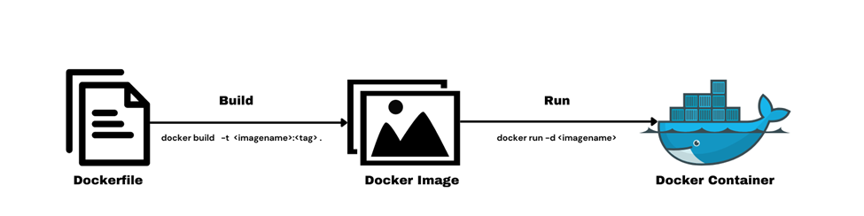
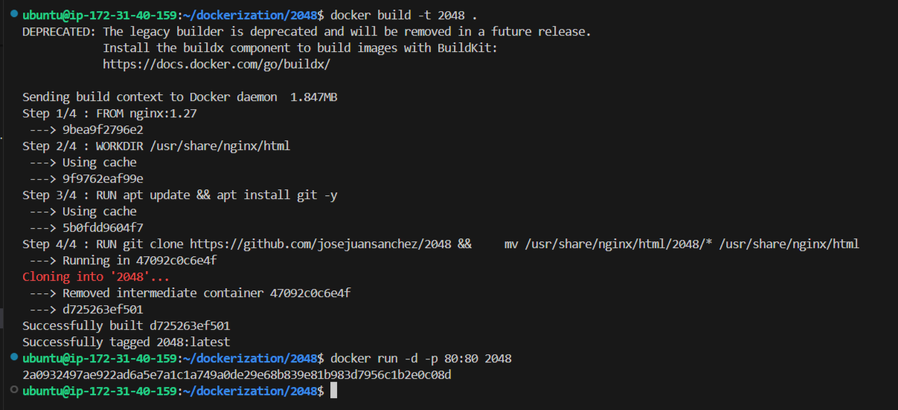
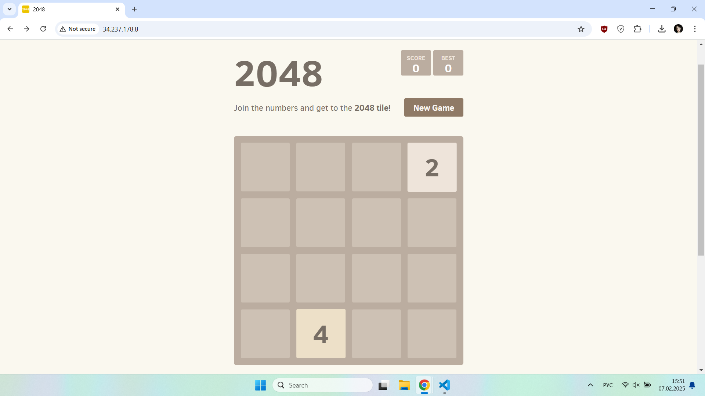
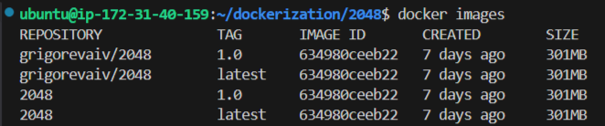
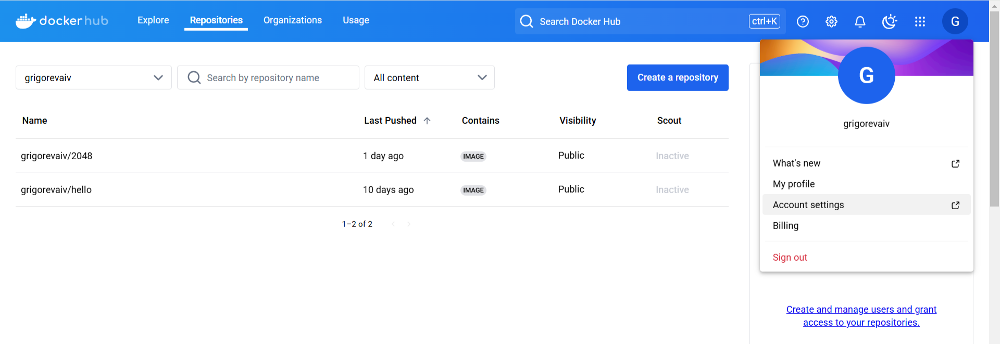
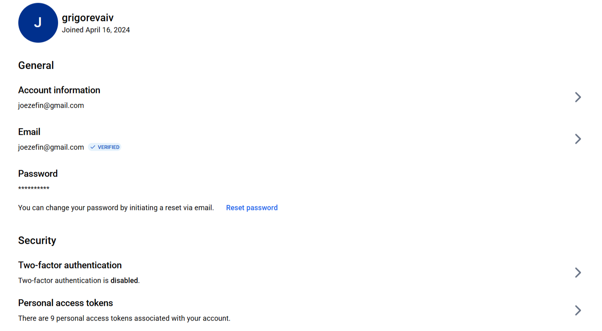
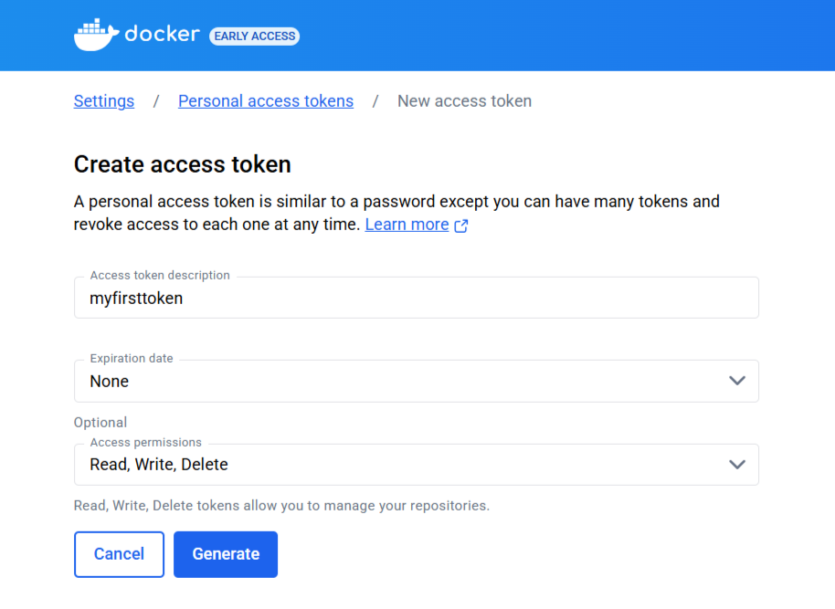
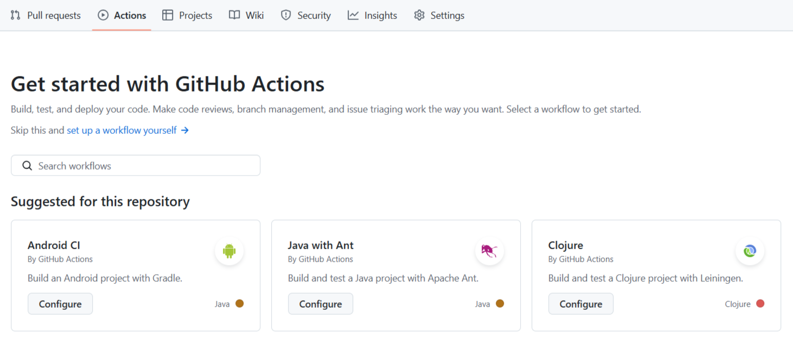
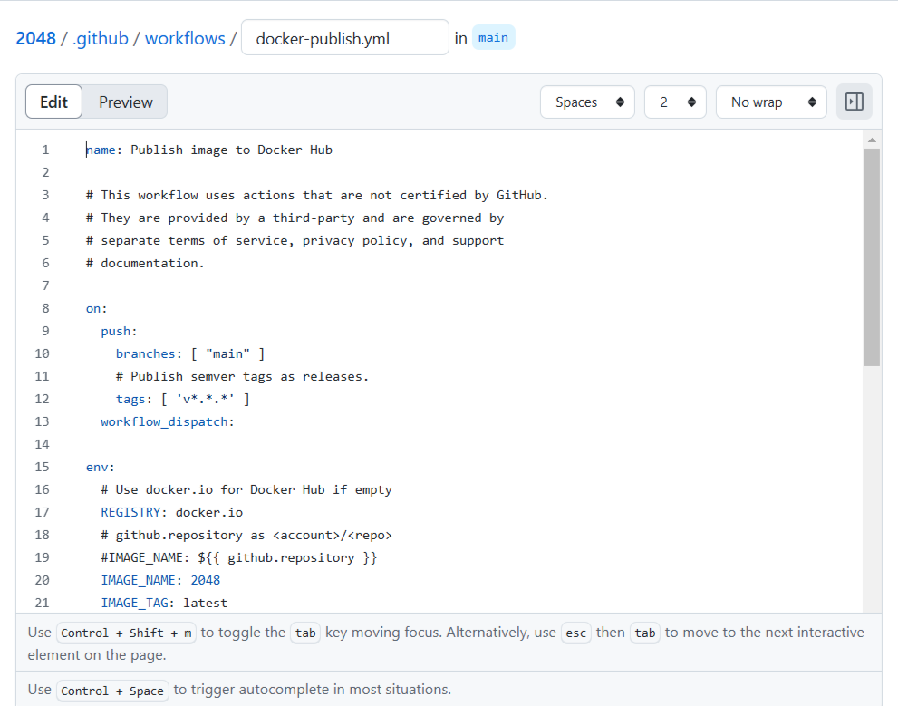
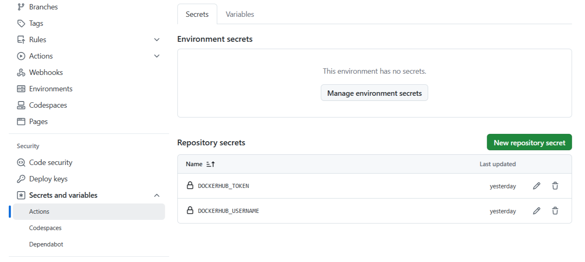

# Despliegue de una web estática con Docker y publicación en Docker Hub
## Requisitos:
1. Una instancia de AWS en ejecución [consulta las instrucciones](https://github.com/grigorevaiv/practica-daw-1.1).
2. Docker y Docker Compose instalados en dicha instancia [consulta las instrucciones](https://github.com/grigorevaiv/practice-5.1).

## Dockerfile: visión general
Un **Dockerfile** es un archivo de texto que contiene instrucciones para construir una imagen de Docker. Define las dependencias necesarias, los comandos a ejecutar y los archivos que deben incluirse en el contenedor.

Instrucciones clave en un Dockerfile:
* ```FROM``` – define la imagen base (por ejemplo, ```FROM nginx:1.27```).
* ```WORKDIR``` – establece el directorio de trabajo dentro del contenedor.
* ```COPY/ADD``` – copia archivos al contenedor.
* ```RUN``` – ejecuta comandos durante la construcción (por ejemplo, ```RUN apt update && apt install -y curl```).
* ```CMD``` / ENTRYPOINT – especifica el comando que se ejecutará al iniciar el contenedor.
* ```EXPOSE``` – declara los puertos utilizados por el contenedor.
* ```ENV``` – define variables de entorno.

Relación entre Dockerfile, imagen y contenedor:
* **Dockerfile** → se usa para crear una imagen.
* **Imagen** → es una plantilla inmutable construida a partir del Dockerfile.
* **Contenedor**  → es una instancia en ejecución de una imagen. Un contenedor ejecuta una aplicación, tiene su propio entorno, pero usa la imagen como base.
Creación y ejecución de un contenedor en Docker



### Como crear Dockerfile
En esta práctica, creas un Dockerfile con el siguiente contenido:
```
# usamos la imagen oficial de Nginx versión 1.27 como base  
FROM nginx:1.27  

# establecemos el directorio de trabajo dentro del contenedor  
WORKDIR /usr/share/nginx/html  

# actualizamos la lista de paquetes e instalamos Git  
RUN apt update && apt install git -y  

# clonamos el repositorio del juego 2048 y movemos los archivos del repositorio clonado a WORKDIR  
RUN git clone https://github.com/josejuansanchez/2048 && \  
    mv /usr/share/nginx/html/2048/* /usr/share/nginx/html  
```
### Como crear imagen a partir de Dockerfile
Para crear una **imagen** a partir de un **Dockerfile**, se usa el comando:
```
docker build -t 2048 .
```
Aquí, ```-t``` asigna un nombre a la imagen, y ```.``` indica el directorio actual, es decir, donde se encuentra el Dockerfile y los archivos necesarios para la construcción de la imagen.
### Como ejecutar un contenedor a partir de la imagen
Para ejecutar un contenedor basado en la imagen creada, se ejecuta:
```
docker run -d -p 80:80 2048
```
El flag ```-d``` ejecuta el contenedor en segundo plano, y ```-p``` mapea los puertos (puerto 80 de la instancia AWS → puerto 80 del contenedor).

La salida del terminal:


Ahora, si introduces la dirección IP pública de tu instancia de AWS en el navegador, verás el siguiente resultado.


Para consultar la lista de imágenes creadas, utiliza el siguiente comando:
```
docker images
```
Ejemplo de salida:



La imagen que deseas publicar en Docker Hub debe contener el nombre de usuario en Docker Hub y el nombre de la imagen. Esta es una regla obligatoria.
```
grigorevaiv/2048
```
Se recomienda agregar una etiqueta para una mejor gestión de versiones. Puedes hacerlo usando el siguiente comando:
```
docker tag 2048 grigorevaiv/2048:1.0
```
## Publicación de la imagen en Docker Hub
Para publicar una imagen en Docker Hub, primero debes iniciar sesión en tu cuenta. Para hacerlo, utiliza el comando:
```
docker login
```
Puedes iniciar sesión utilizando tu nombre de usuario y contraseña, o usando un token. Para crear un token:
1. Inicia sesión en tu cuenta de Docker Hub.
2. Haz clic en el ícono de tu perfil en la esquina superior derecha.

3. Ve a Configuración de cuenta.

4. Selecciona la pestaña Personal access tokens.

5. Haz clic en Generar nuevo token y selecciona los permisos necesarios (**lectura, escritura y eliminación**).
6. Copia el token y utilízalo para iniciar sesión en la terminal.
7. Una vez que ingreses el token en la terminal, estarás autenticado en Docker Hub.

Cuando hayas iniciado sesión en Docker Hub, puedes publicar la imagen creada utilizando el siguiente comando:
```
docker push grigorevaiv/2048:1.0
```
Ahora tu imagen será publicada en Docker Hub y estará disponible para su uso o descarga.
## Publicación de la imagen en Docker Hub con GitHub Actions
Puedes automatizar la actualización de imágenes de Docker en Docker Hub cada vez que hagas un git push. Para implementarlo, sigue estos pasos:

**Se recomienda revisar la documentación oficial de GitHub Actions en [este enlace](https://docs.github.com/en/actions).**

1. Crea un workflow para GitHub Actions
    * Accede a tu repositorio en GitHub →
    * Abre la pestaña Actions →
    * Haz clic en "Set up a workflow yourself" →
    
    * En el editor que se abre, pega el contenido del archivo [enlace al archivo](https://github.com/josejuansanchez/2048-github-actions/blob/main/.github/workflows/publish-to-docker-hub.yml)  →
 
    *  Guarda los cambios haciendo clic en "Commit changes".
2. Configura las variables secretas
    * Para que el workflow pueda autenticarse en Docker Hub, debes agregar variables secretas:
        * Ve a Settings → Secrets and variables → Actions
 
        * Haz clic en "New repository secret" y crea la variable ```DOCKERHUB_USERNAME``` con tu nombre de usuario de Docker Hub
        * Haz clic en "New repository secret" nuevamente, genera un Personal Access Token en Docker Hub y guárdalo con el nombre ```DOCKERHUB_TOKEN```

Ahora, cada vez que hagas un git push, tu imagen se reconstruirá y se subirá automáticamente a Docker Hub.
